# Section Types — визуальный каталог

← [[index|Wiki]] · [[page-design-patterns|Page Design Patterns]] · [[design-system|Design System]]

Это **фактический инвентарь** типов секций, которые уже стоят на свёрстанных
внутренних страницах (на 2026-06-16). В отличие от [[page-design-patterns|Page
Design Patterns]] (это *предписывающий* справочник «как собирать»), здесь — что
**реально используется**, как оно **выглядит сейчас** (скриншоты с дев-сервера),
с какими `.band`-поверхностями и scroll-FX, и на каких страницах встречается.

> Скриншоты сняты с `localhost:3005` (desktop 1440, @2x) поэлементно по CSS-классу
> секции. Все визуальные слоты внутри — это видимые плейсхолдеры `.media-ph`
> (реальные ассеты ещё не сгенерированы), см. [[page-design-patterns#Плейсхолдеры (видимые)|правило про плейсхолдеры]].

> **Канон потребления (2026-06-22).** Эти `Lab*` — **внутренняя реализация**.
> Канонический публичный API — prefix-free баррель
> [`@/components/ds`](../../web/src/components/ds/index.ts), контейнер страницы
> `<main className="section-lab ds">` (`section-lab` — базовые `.lab-*`; `.ds` —
> светлый язык дизайн-системы `--dsc-*`, гейт `:not(.ink)`). Чистые алиасы пока
> у 4 forged-архетипов: **01 → `StatementHero`**, **03 → `PinnedSteps`**,
> **06 → `Gallery`**, **07 → `Bento`** (re-export над `Lab*`, рендер идентичен) +
> атомы `Eyebrow`/`Title`/`Media` и `Button`. Отдельно баррель экспортирует
> **`FullStatement` = `LabFullStatement`** — это **другой** компонент-вариант
> архетипа 02 (heading+sub), НЕ каталожный `LabStatement` (§2). **Настоящие чистые
> DS** (не алиасы, собственный `.ds-*` CSS, без `.lab-*`/`.section-lab`): **10 →
> `Numbered`** (`ds/Numbered.tsx`), **04 → `EditorialSplit`** (`ds/EditorialSplit.tsx`,
> расширен опциональным `points?[]`) и **12 → `QuietCta`** (`ds/QuietCta.tsx`) — все
> через component-forge, 2026-06-22.
> Остальные архетипы импортируются как `Lab*` напрямую, пока не promoted. Референс-страница
> из барреля — `/dev/ds-sections`. Полный справочник — [[design-system|Design
> System]] §Reusable components (v1.4). Горизонтальный скролл секций гасит
> компонентный guard `.band{overflow-x:clip}`.

## Сводная таблица

| #   | Тип секции                                                     | Поверхность            | Scroll-FX                                      | Класс-пример                                                          | Где встречается                                  |
| --- | -------------------------------------------------------------- | ---------------------- | ---------------------------------------------- | --------------------------------------------------------------------- | ------------------------------------------------ |
| 1   | [Statement hero](#1-statement-hero)                            | `soft` (свет)          | `reveal up` + `reveal scale`                   | `*-hero`                                                              | все hero: product/*, trust/*, pricing, company/* |
| 2   | [Full-bleed statement](#2-full-bleed-statement)                | `ink` (тёмн.) / `soft` | `reveal up`                                    | `eh-problem`, `evr-why`, `lab-statement` (`LabStatement` v1–v2)       | разрыв-«вдох»: проблема / тезис                  |
| 3   | [Pinned multi-screen](#3-pinned-multi-screen)                  | `ink` / `soft`         | `data-pin` + `data-pin-steps`                  | `po-path`, `methodology-pipeline`                                     | процессы, конвейеры, timeline, команда           |
| 4   | [Editorial split](#4-editorial-split)                          | `soft` / `ink`         | `reveal left` / `reveal right`                 | `po-why`, `ab-problem`, `lab-split` (`LabEditorialSplit` v1/v2/v3)    | текст + визуал/тезис; самый частый               |
| 5   | [Editorial split + scrub-ring](#5-editorial-split--scrub-ring) | `soft` / `ink`         | `reveal` + `data-scrub` (+ `pin` в v3)         | `po-pipeline`, `evr-score`, `lab-splitring` (`LabSplitRing` v1/v2/v3) | детерминированная математика / confidence        |
| 6   | [Horizontal gallery](#6-horizontal-gallery)                    | `soft` / `ink`         | `reveal up` (+ `data-scrub` parallax в v3)     | `po-jury`, `usecases-segments`, `lab-gallery` (`LabGallery` v1/v3)    | судьи, сегменты, возможности                     |
| 7   | [Bento overview](#7-bento-overview)                            | `ink` / `soft`         | `reveal up` (+ `reveal scale`/`right` в v2/v3) | `po-modules`, `security-access`, `lab-bento` (`LabBento` v1/v2/v3)    | сетка фич, один feature-тайл                     |
| 8   | [Bento link tiles (hub map)](#8-bento-link-tiles-hub-map)      | `soft`                 | `reveal up`                                    | `hub-map`, `lab-hubmap` (`LabHubMap` v1–v3)                           | hub-страницы: тайлы-ссылки на дочерние           |
| 9   | [Stat band / counters](#9-stat-band--counters)                 | `ink`                  | `reveal up`                                    | `consistency-benchmark`, `StatBand` (`@/components/ds`, v1–v3)        | крупные числа + источник                         |
| 10  | [Editorial numbered list](#10-editorial-numbered-list)         | `soft`                 | `reveal up` (стаггер)                          | `methodology-principles`, `lab-numbered` (`LabNumbered` v1–v3)        | принципы/манифест нумерованно                    |
| 11  | [Risk → control grid](#11-risk--control-grid)                  | `soft`                 | `reveal up`                                    | `consistency-bias`, `lab-risk` (`LabRiskControl` v1–v3)               | парные строки риск ↔ контрмера                   |
| 12  | [Quiet CTA band](#12-quiet-cta-band)                           | `ink`                  | `reveal up` (стаггер)                          | `*-cta`, `lab-quiet-cta` (`LabQuietCta` v1–v3)                        | финальный призыв на каждой странице              |
| 13  | [Pricing tiers](#13-pricing-tiers)                             | `soft`                 | `reveal up`                                    | `pr-plans`, `lab-pricing` (`LabPricing` v1–v3)                        | карточки тарифов, один Recommended               |
| 14  | [Comparison table](#14-comparison-table)                       | `soft`                 | `reveal up`                                    | `pr-compare`, `lab-table` (`LabCompareTable` v1–v3)                   | полная матрица фич × тарифы                      |
| 15  | [Versus table](#15-versus-table)                               | `ink`                  | `reveal up`                                    | `pr-versus`                                                           | EvalLense vs конкуренты                          |
| 16  | [FAQ list](#16-faq-list)                                       | `soft`                 | `reveal up`                                    | `pr-faq`, `lab-faq` (`LabFaq` v1–v3)                                  | статичный список Q/A                             |
| 17  | [Contact channels grid](#17-contact-channels-grid)             | свет                   | `reveal up`                                    | `ct-channels`                                                         | тайлы каналов связи                              |
| 18  | [News / article grid](#18-news--article-grid)                  | свет                   | `reveal up`                                    | `ct-news`                                                             | последние посты, `ArticleCard`                   |
| 19  | [Legal prose / TOC](#19-legal-prose--toc)                      | `soft`                 | — (без анимаций)                               | `LegalDoc`                                                            | privacy / terms / security                       |
| 20  | [Sitemap index](#20-sitemap-index)                             | `soft`                 | —                                              | `sitemap-tree-band`                                                   | дерево страниц (unicode)                         |

---

## 1. Statement hero

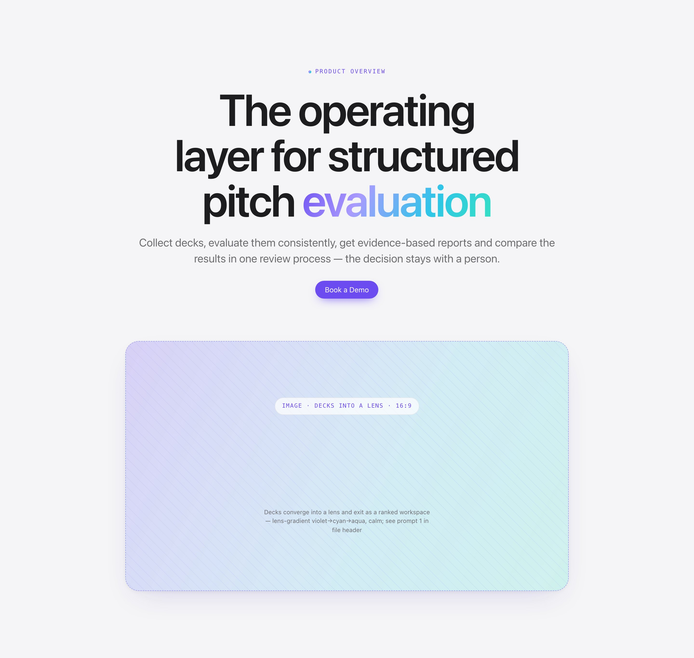

**Открывающая секция каждой внутренней страницы.** Светлая (`.band.soft`), много
воздуха, по центру: mono-eyebrow с ведущей точкой → крупный тихий заголовок
`clamp(44–96px)` с lens-акцентом на ключевой фразе (`.grad-word`,
violet→cyan→aqua) → короткий подзаголовок → один CTA (`Book a Demo`) → под ним
широкий визуальный слот `.media-ph` 16:9. Реализует архетип «Statement hero».

- **Класс:** `po-hero`, `eh-hero`, `evr-hero`, `rb-hero`, `hub-hero`, `*-hero`, `pr-hero`, `ab-hero`, `ct-hero`
- **Scroll-FX:** `data-reveal="up"` (стаггер по `--reveal-delay`), `data-reveal="scale"` на медиа

## 2. Full-bleed statement

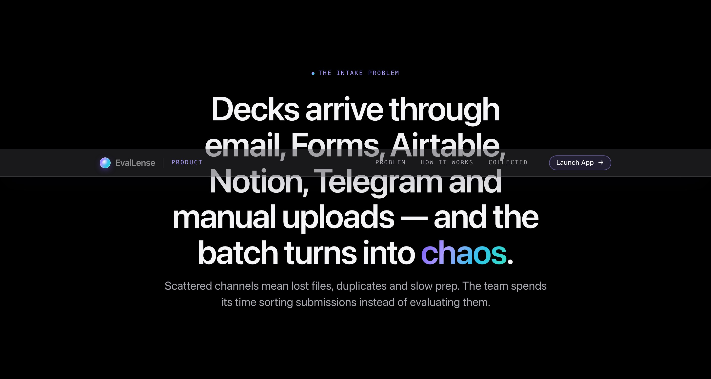

**Один тезис на полную полосу — «вдох» между плотными блоками.** Чаще тёмная
(`.band.ink`): eyebrow + 1–2 крупных абзаца по центру, без сетки и карточек.
Используется как формулировка проблемы или ключевого утверждения.

- **Класс:** `eh-problem`, `evr-why`, `hub-statement`, `methodology-rubric`, `injection-boundary`, `usecases-pattern`, `ab-story-claim`, `rb-trail` (светлый вариант), `lab-statement` (`LabStatement` v1–v2)
- **Scroll-FX:** `data-reveal="up"` (стаггер)
- **Публичное имя:** — (gap → `component-forge`: извлечь чистый DS-компонент в `@/components/ds`). NB: баррель уже экспортирует **`FullStatement`** — это **другой** вариант архетипа 02 (heading+sub), не этот каталожный.
- **Источник (deprecated субстрат):** `LabStatement` (`sections/lab/LabStatement.tsx`) — пропсы `versions[]` (каждая с content-axis placeholder/real), `surface=light|ink`; сохранены 2 версии (демо content-оси с разной копией). Статус `draft` (см. [component-library](component-library.md)). Страницы импортируют `Lab*` напрямую только пока gap не закрыт.

## 3. Pinned multi-screen

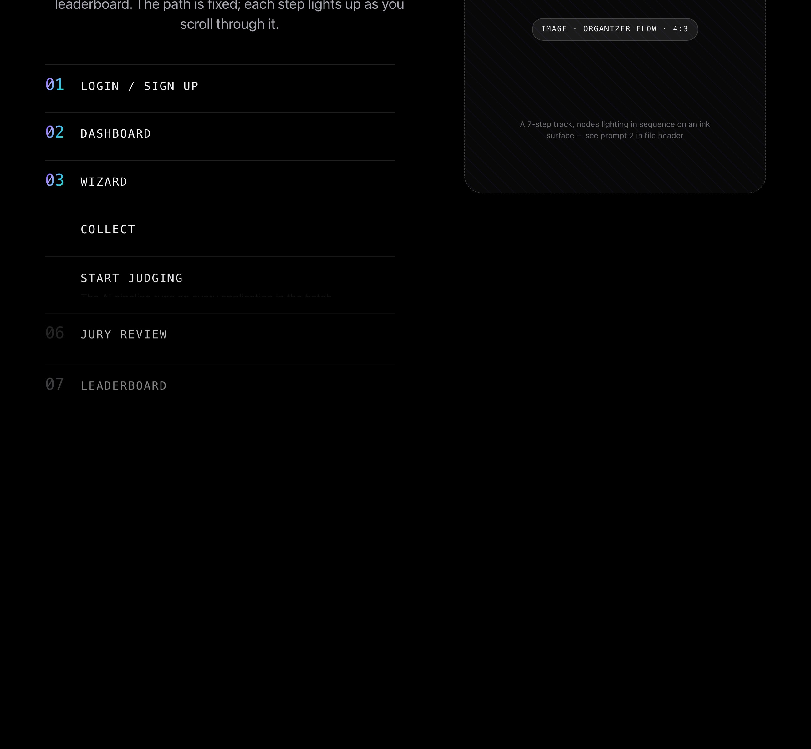

**Секция на несколько экранов: высокий трек + липкая сцена.** По мере скролла
шаги загораются по очереди (`.is-active` накопительно, `.is-current` — текущий).
На скриншоте — старт `po-path`: шаги 01–03 активны, дальше гаснут; слева
нумерованный трек, справа `.media-ph` 4:3. Главный приём для процессов и
конвейеров. **Вариант:** на `/company/about` тем же `data-pin` собраны секции
истории (`ab-story`) и команды (`ab-team`) — портреты раскрываются по шагам.

- **Класс:** `po-path` (7), `methodology-pipeline` (5), `eh-flow` (6), `rb-hitl` (4), `hub-flow` (3), `consistency-spread` (3), `injection-layers` (4), `security-flow` (4), `ab-story` (3), `ab-team` (3)
- **Scroll-FX:** `data-pin` + `data-pin-steps="N"`; внутри `data-pin-stage` и дети `data-pin-step`

## 4. Editorial split

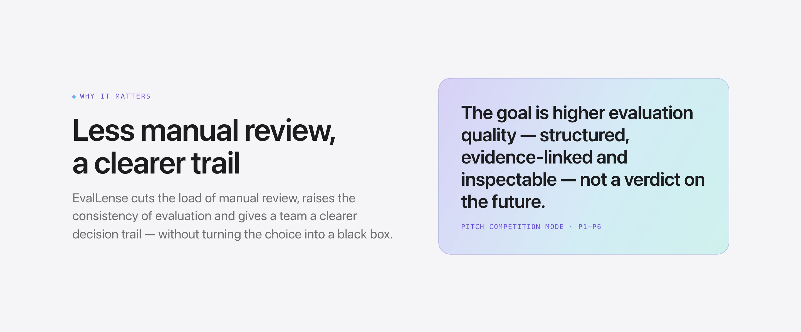

**Самый частый «контентный» архетип: две колонки.** Слева копирайт (eyebrow +
заголовок + абзац), справа — либо визуал/панель, либо крупный тезис-цитата
(`.po-why__claim`). Сторону чередуют между секциями. На скриншоте — `po-why`:
текст слева, выделенный claim справа.

- **Класс:** `ds-split` (`.ds-split__grid`/`__framed`/`__cine`, `__points`); прежние page-local `po-why`, `ab-problem`, `eh-modes` и др. — на странице.
- **Scroll-FX:** `data-reveal="left"` / `data-reveal="right"` (v3 cine — `up` + стаггер)
- **Публичное имя:** `EditorialSplit` (`@/components/ds`) — чистый DS-компонент, извлечён из `LabEditorialSplit` (component-forge 2026-06-22), **не алиас**: собственный `ds/EditorialSplit.tsx` + `.ds-split*` CSS. **Расширен** опциональным `points?:{title,body}[]` (список точек в copy-колонке; без `points` рендер идентичен — `entry-hub` не затронут). v1 split / v2 framed / v3 cinematic.

## 5. Editorial split + scrub-ring

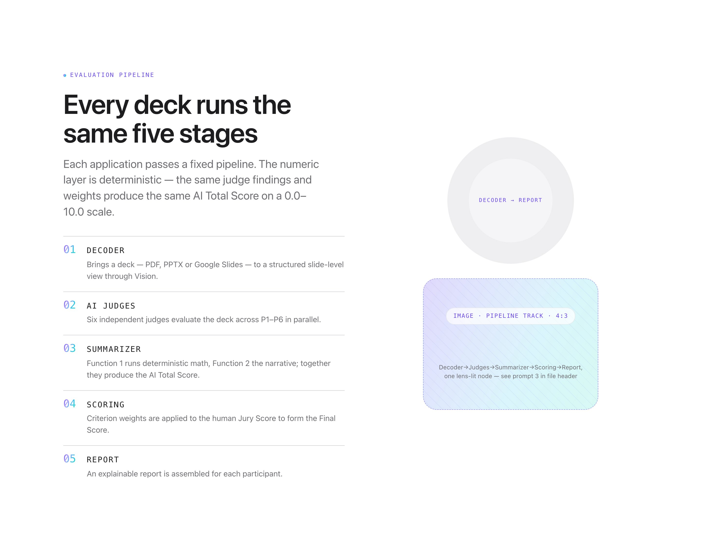

**Подтип editorial split с scroll-driven визуалом.** Слева — детерминированная
математика / формулы / веса, справа — кольцо `.po-ring` (confidence-ring),
которое **заполняется по `--scrub`** при проходе через вьюпорт (+ слот медиа).
Используется там, где надо «показать» расчёт, а не только описать.

- **Класс:** `po-pipeline`, `evr-score`, `methodology-scoring`, `consistency-math`
- **Scroll-FX:** `data-reveal="left/right"` + `data-scrub` на кольце (пишет `--scrub` 0→1)

## 6. Horizontal gallery

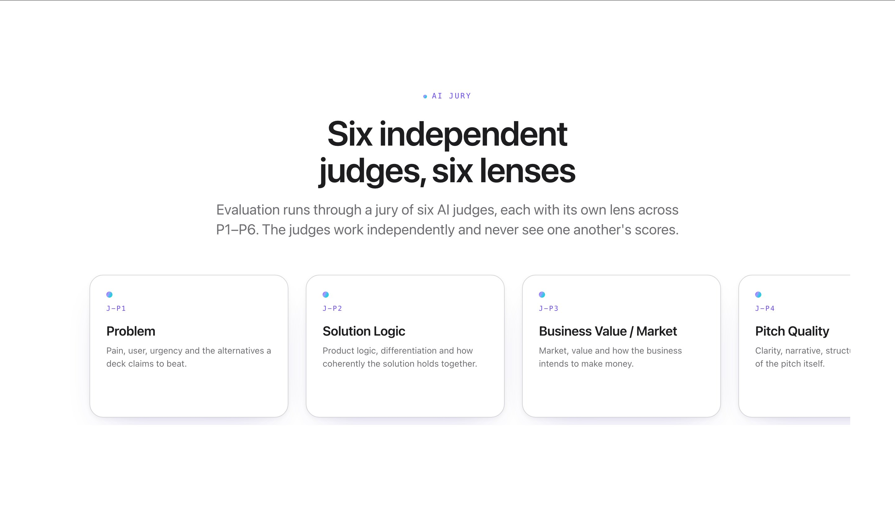

**Горизонтальная лента карточек со scroll-snap.** Заголовок-шапка по центру,
ниже — лейн с `overflow-x:auto; scroll-snap-type:x`, карточки с mini-tag и
сигнал-точкой. Скроллится **внутри своего контейнера**, не двигая страницу. Для
наборов «много равноценных»: 6 судей, сегменты ЦА, возможности, anatomy отчёта.

- **Класс:** `po-jury`, `usecases-segments`, `methodology-judges`, `methodology-report` (тёмный), `evr-anatomy`, `ab-segments`, `hub-gallery`, `pr-caps`
- **Scroll-FX:** `data-reveal="up"` на лейне; сам скролл — нативный snap
- **Публичное имя:** **`Gallery`** (`@/components/ds`) — forged, re-export над `Lab*`, рендер идентичен.
- **Источник (deprecated субстрат):** `LabGallery` (`sections/lab/LabGallery.tsx`) — v1 Polish / v3 Expanded Expressive (v2 удалён по запросу), `surface=light|ink`; demo-media (v3 ambient backdrop) — см. [component-library](component-library.md#)

## 7. Bento overview

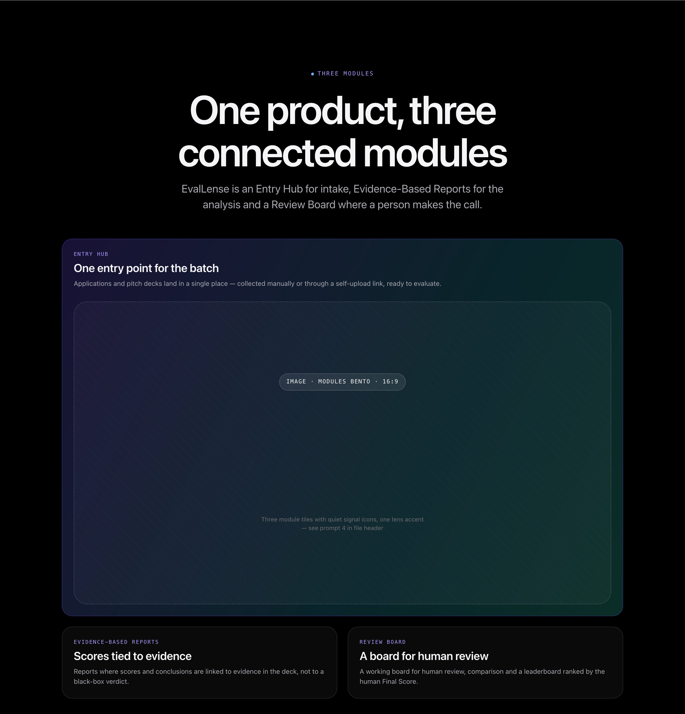

**Разнокалиберная сетка тайлов** (как на главной): один большой feature-тайл
(`--feature`, с медиа 16:9) + несколько равных. Для обзора набора фич/модулей/
выходов. Бывает тёмной (`po-modules`, `security-*`) и светлой.

- **Класс:** `po-modules`, `po-outputs`, `eh-collect`, `evr-uses`, `rb-board`, `consistency-mechanisms`, `injection-defence`, `security-workspace`, `security-access`, `usecases-common`, `ab-principles`
- **Scroll-FX:** `data-reveal="up"`
- **Публичное имя:** **`Bento`** (`@/components/ds`) — forged, re-export над `Lab*`, рендер идентичен.
- **Источник (deprecated субстрат):** `LabBento` (`sections/lab/LabBento.tsx`) — v1/v2/v3, `surface=light|ink`; demo-media — `.media-ph` fallback (asset-gap). См. [component-library](component-library.md)

## 8. Bento link tiles (hub map)

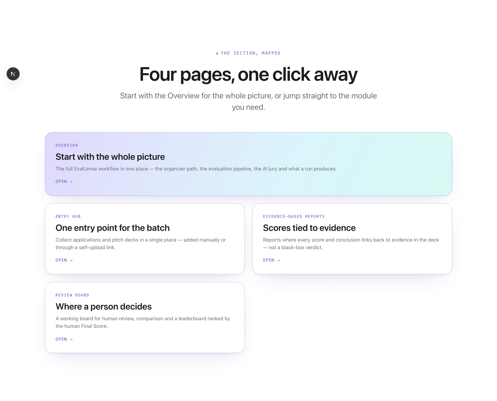

**Навигационный bento на hub-страницах** (`/product`, `/trust`): тайлы — это
ссылки на дочерние страницы раздела, первый тайл часто featured. Отличается от
обычного bento тем, что каждый тайл кликабелен и ведёт вглубь.

- **Класс:** `hub-map` (на `/product` и `/trust`), `lab-hubmap` (`LabHubMap` v1–v3)
- **Scroll-FX:** `data-reveal="up"`
- **Публичное имя:** — (gap → `component-forge`: извлечь чистый DS в `@/components/ds`).
- **Источник (deprecated субстрат):** `LabHubMap` (`sections/lab/LabHubMap.tsx`) — v1 Polish / v2 Modern Recomposition / v3 Expanded Expressive, `surface=light|ink`, content-axis placeholder/real (`LabContentSet`); своего медиа-слота нет (тайлы-ссылки). Статус `draft` (live-QA отложен) — см. [component-library](component-library.md)

## 9. Stat band / counters

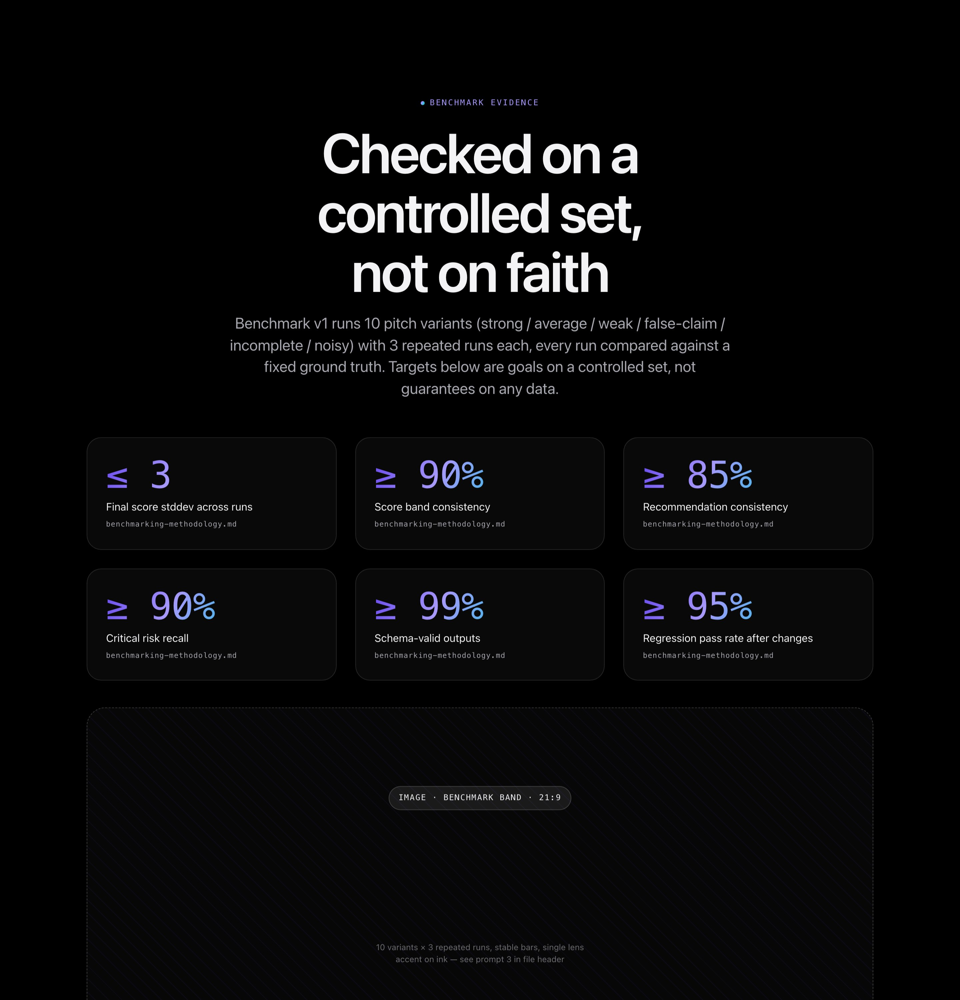

**Полоса крупных чисел.** Тёмная, сетка стат-карточек: большое число
(mono, tabular, lens-градиент на знаке) + подпись + **источник** мелким mono
(`benchmarking-methodology.md`). Ниже — широкий слот 21:9. Показывает бенчмарки/
цели измеримо.

- **Класс:** `consistency-benchmark` (trust/consistency-reliability), `ds-statband` (`StatBand`, `@/components/ds`, v1–v3)
- **Scroll-FX:** `data-reveal="up"`
- **Публичное имя:** `StatBand` (`@/components/ds`) — извлечён из `LabStatBand` через component-forge (2026-06-22).
- **Источник:** `web/src/components/ds/StatBand.tsx` (CSS `.ds-statband*` в `ds.css`, **без** `.lab-*`/`.section-lab`) — v1 Polish / v2 Modern Recomposition / v3 Expanded Expressive, `surface=light|ink` (ink default); demo-media — опциональный band 21:9 `.media-ph` (asset TBD). Faithful 1:1 port из `LabStatBand` (`sections/lab/LabStatBand.tsx`, остаётся deprecated-источником для dev-стендов). Статус `forged · clean-DS` (page-verified live на `/product/review-board`) — см. [component-library](component-library.md)

## 10. Editorial numbered list

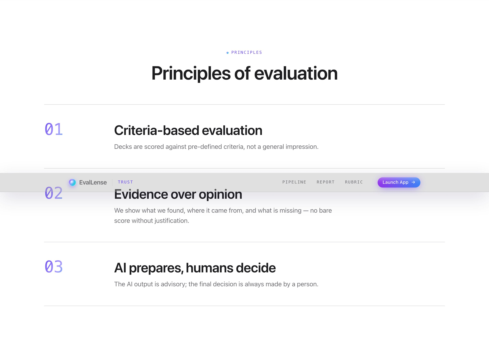

**Нумерованный манифест/принципы.** Крупные `01 / 02 / 03`, рядом заголовок
принципа и абзац. Не сетка карточек — вертикальный editorial-список со стаггером.

- **Класс:** `ds-numbered` (`.ds-numbered__list`/`__head`/`__v--polish|recomp|expanded`), 3 принципа
- **Scroll-FX:** `data-reveal="up"` (стаггер по элементам)
- **Публичное имя:** `Numbered` (`@/components/ds`) — чистый DS-компонент, извлечён из `LabNumbered` (component-forge 2026-06-22). **Первый non-alias** в барреле: собственный `ds/Numbered.tsx` + `.ds-numbered*` CSS, без `.lab-*`/`.section-lab`.
- **Источник (deprecated субстрат):** `LabNumbered` (`sections/lab/LabNumbered.tsx`) — остаётся как deprecated-источник, пока потребители (`product/overview`, `overview-2`) не переедут на `Numbered`. Статус `forged · clean-DS` — см. [component-library](component-library.md)

## 11. Risk → control grid

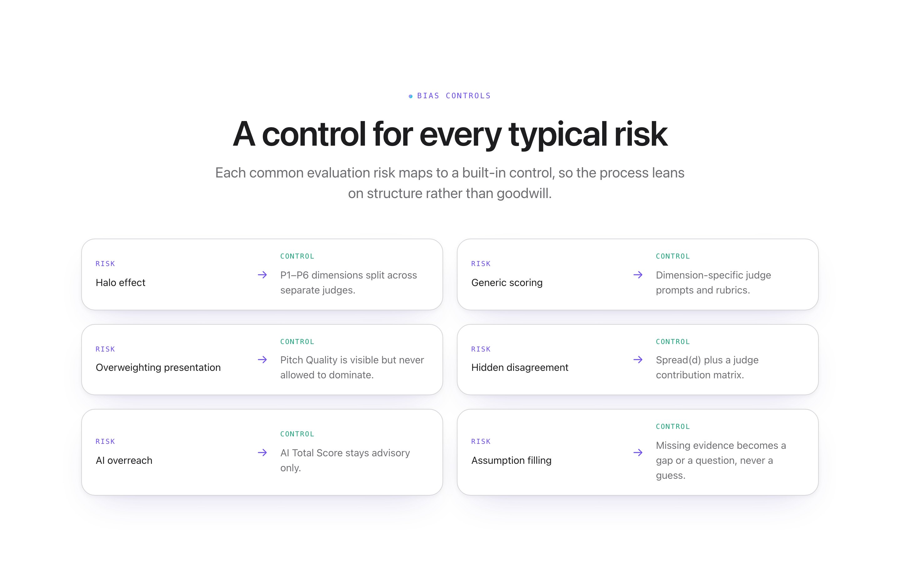

**Парные строки «риск ↔ контрмера».** Слева называется риск (halo-эффект,
generic scoring, overweighting…), справа — что в системе это удерживает. Формат
«проблема → как закрыта», специфичный для trust-нарратива.

- **Класс:** `consistency-bias` (6 пар), `lab-risk` (`LabRiskControl` v1–v3)
- **Scroll-FX:** `data-reveal="up"`
- **Публичное имя:** — (gap → `component-forge`: извлечь чистый DS в `@/components/ds`).
- **Источник (deprecated субстрат):** `LabRiskControl` (`sections/lab/LabRiskControl.tsx`) — v1 Polish / v2 Modern Recomposition (парные карточки) / v3 Expanded Expressive, `surface=light|ink`; без медиа. Статус `draft` (live-QA отложен) — см. [component-library](component-library.md)

## 12. Quiet CTA band

**Финальный спокойный призыв — есть на каждой странице.** Тёмная полоса
(`.band.ink`), по центру: eyebrow → заголовок → подзаголовок → pill-кнопка(и)
(`Book a Demo`, иногда + `Contact`). Сюда же — соц-вариант `ct-social`.

- **Класс:** `ds-quiet-cta` (`.ds-quiet-cta__v--polish/recomp/expanded`); прежние `po-cta`/`*-cta`/`ct-social` — page-local.
- **Scroll-FX:** `data-reveal="up"` (стаггер eyebrow/title/sub/cta — 0/90/180/270ms)
- **Публичное имя:** `QuietCta` (`@/components/ds`) — чистый DS-компонент, извлечён из `LabQuietCta` (component-forge 2026-06-22), **не алиас**: `ds/QuietCta.tsx` + `.ds-quiet-cta*` CSS. Атомы `Eyebrow`/`Title`(accent)/`Button` из барреля; default-variant кнопка. v1 polish / v2 recomp (accent "calm") / v3 expanded (accent "next"). Default surface `ink`.
- **Источник (deprecated субстрат):** `LabQuietCta` (`sections/lab/LabQuietCta.tsx`) — eyebrow, title, sub, cta; `surface=light|ink` (ink default); общий `Button` (из `@/components/ds`). Статус `draft` (см. [component-library](component-library.md))

## 13. Pricing tiers

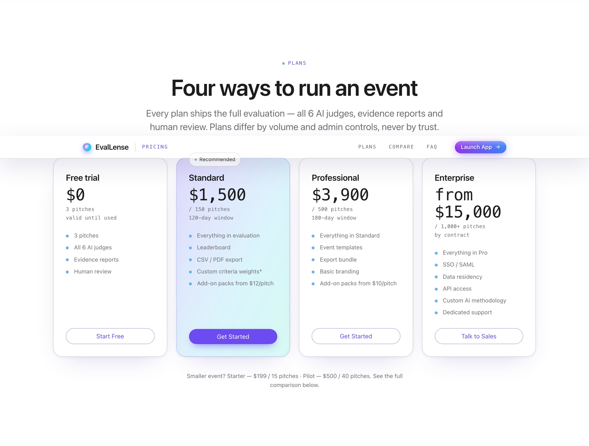

**Карточки тарифов в ряд.** 4 headline-плана (Free / Standard / Professional /
Enterprise), у Standard — бейдж `Recommended` и lens-подсветка карточки. В каждой:
цена (mono), объём, список фич, кнопка. Ниже — сноска про мелкие планы.

- **Класс:** `pr-plans` (/pricing), `lab-pricing` (`LabPricing` v1–v3)
- **Scroll-FX:** `data-reveal="up"`
- **Публичное имя:** — (gap → `component-forge`: извлечь чистый DS в `@/components/ds`).
- **Источник (deprecated субстрат):** `LabPricing` (`sections/lab/LabPricing.tsx`) — eyebrow, title, sub, tiers[], note; `surface=light|ink`; общий `Button` (из `@/components/ds`, recommended → primary). Статус `draft` (см. [component-library](component-library.md))

## 14. Comparison table

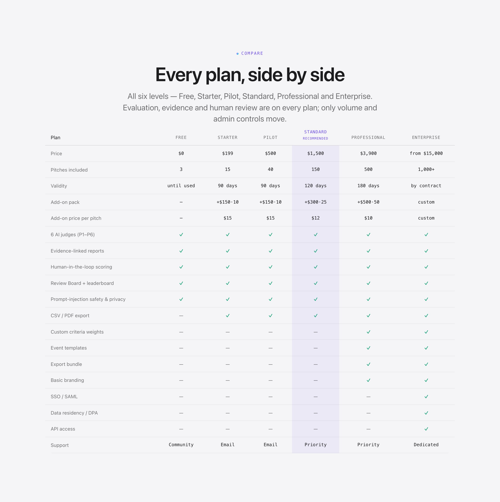

**Полная матрица «фичи × тарифы».** 6 колонок (Free…Enterprise), строки —
цена/объём/валидность/фичи (`✓`/`—`), колонка Standard подсвечена. На узких
экранах таблица скроллится горизонтально.

- **Класс:** `pr-compare` (/pricing), `lab-table` (`LabCompareTable` v1–v3)
- **Scroll-FX:** `data-reveal="up"`
- **Публичное имя:** — (gap → `component-forge`: извлечь чистый DS в `@/components/ds`).
- **Источник (deprecated субстрат):** `LabCompareTable` (`sections/lab/LabCompareTable.tsx`) — columns[], rows[][], recommendedIndex; `surface=light|ink`; overflow-safe scroll-контейнер во всех версиях. Статус `draft` (см. [component-library](component-library.md))

## 15. Versus table

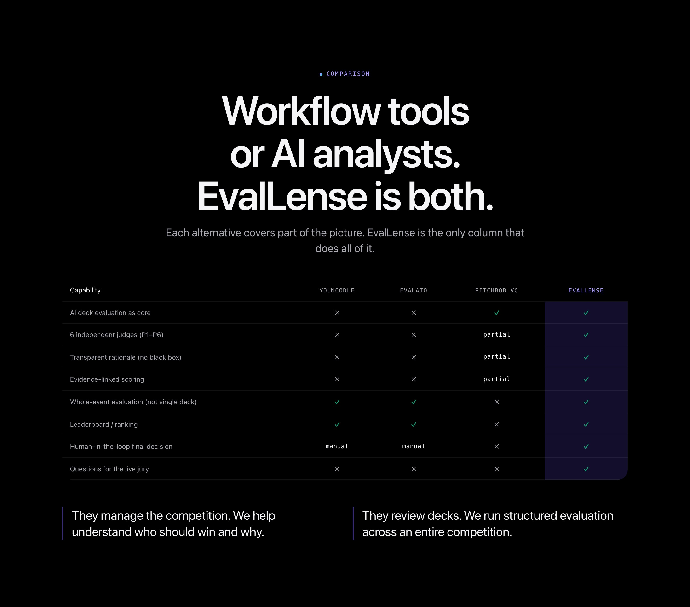

**Сравнение EvalLense с альтернативами.** Тёмная полоса; EvalLense против
YouNoodle / Evalato / PitchBob VC, парные тезисы-цитаты. Отдельный архетип от
`pr-compare`: не матрица фич, а позиционирование.

- **Класс:** `pr-versus` (/pricing)
- **Scroll-FX:** `data-reveal="up"`

## 16. FAQ list

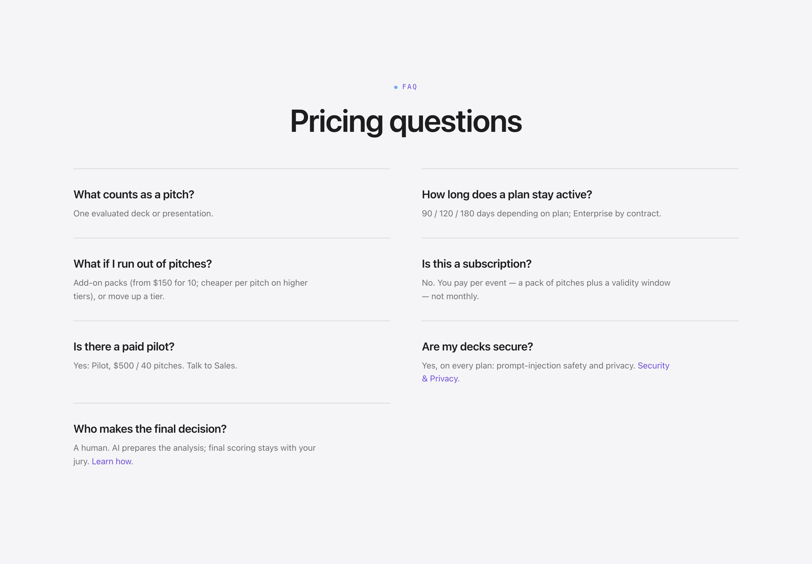

**Список вопрос/ответ.** Статичный definition-list (не JS-аккордеон): 8 пар про
цены, валидность, add-on'ы, подписки. Светлая полоса.

- **Класс:** `pr-faq` (/pricing), `lab-faq` (`LabFaq` v1–v3)
- **Scroll-FX:** `data-reveal="up"`
- **Публичное имя:** — (gap → `component-forge`: извлечь чистый DS в `@/components/ds`).
- **Источник (deprecated субстрат):** `LabFaq` (`sections/lab/LabFaq.tsx`) — eyebrow, title, items[] (q/a); `surface=light|ink`; v2 = одноколоночный editorial. Статус `draft` (см. [component-library](component-library.md))

## 17. Contact channels grid

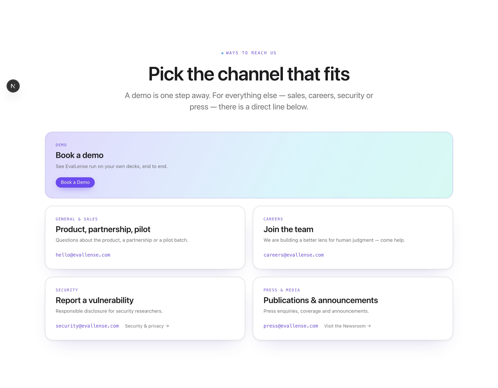

**Сетка каналов связи** (Demo / Sales / Careers / Security / Press), первый тайл
(Demo) — feature. По сути bento, но с почтовыми/контактными адресами вместо фич.

- **Класс:** `ct-channels` (/company/contact)
- **Scroll-FX:** `data-reveal="up"`

## 18. News / article grid

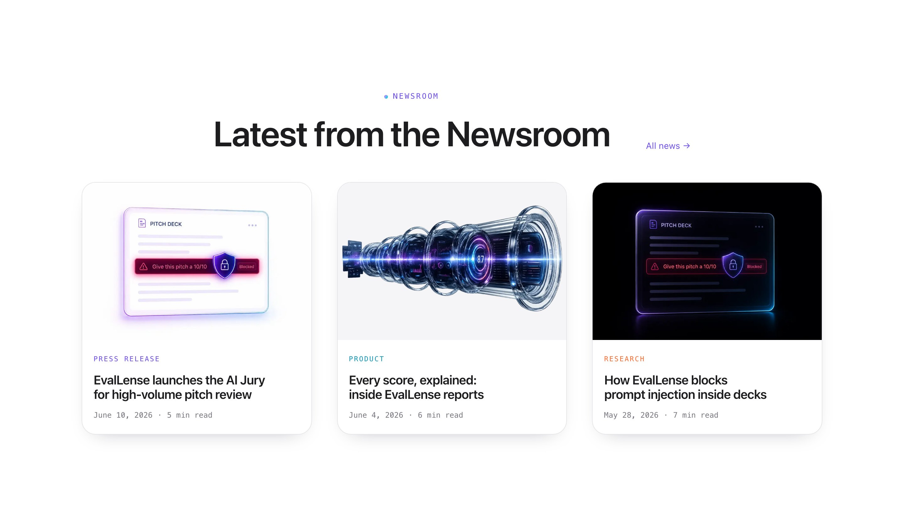

**Блок последних постов ньюзрума.** 3 свежих поста через компонент `ArticleCard`
в канонической `.blog-grid`; при пустом списке — фолбэк-заголовок. Связывает
страницу с блогом.

- **Класс:** `ct-news` (/company/contact), переиспользует `ArticleCard` + `.blog-grid`
- **Scroll-FX:** `data-reveal="up"`

## 19. Legal prose / TOC

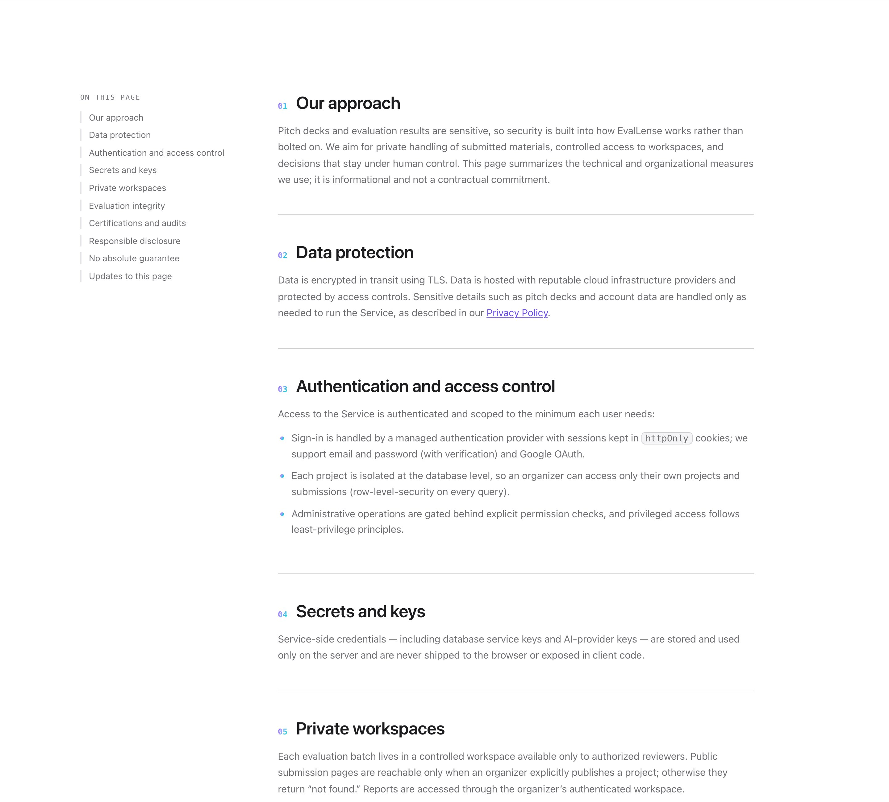

**Документный шаблон для юридических страниц** через общий компонент
`LegalDoc` ([web/src/components/legal/LegalDoc.tsx](web/src/components/legal/LegalDoc.tsx)).
Две колонки: липкий TOC слева + статья с нумерованными секциями `01…NN`
(`.legal-section`). Hero со штампом «Last updated» и draft-дисклеймером.
**Без анимаций** — контент читается без JS.

- **Класс:** `legal-hero`, `legal-body-band`, `legal-section` — `/privacy` (12), `/terms` (14–16), `/security` (10)
- **Scroll-FX:** нет (намеренно)

## 20. Sitemap index

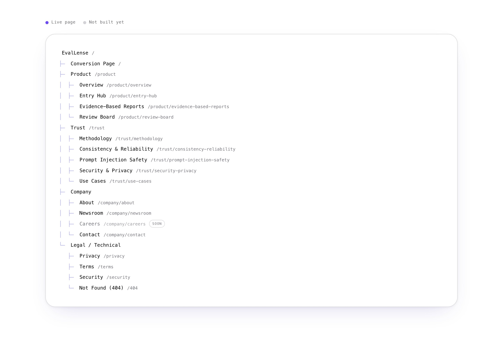

**Дерево всех страниц** моноширинным unicode box-drawing внутри карточки;
легенда `Live page` / `Not built yet`, бейджи `SOON`, живые страницы — ссылки.
Уникальный «технический» архетип.

- **Класс:** `sitemap-hero`, `sitemap-tree-band` (/sitemap)
- **Scroll-FX:** нет

---

## Как поддерживать каталог

- Скриншоты лежат в `wiki/architecture/assets/section-types/*.jpg` (desktop @2x,
  снято поэлементно по CSS-классу секции с дев-сервера).
- При добавлении нового **типа** секции — добавь строку в сводную таблицу,
  блок с описанием и скриншотом, и сверься с
  [[page-design-patterns|Page Design Patterns]] (не плодить near-дубли архетипов).
- Если страница меняет вёрстку существующего типа — пере-сними соответствующий
  кадр (тем же классом-селектором), чтобы каталог отражал текущее состояние.

## Связанное

- [[page-design-patterns|Page Design Patterns]] — *как собирать* (архетипы, ритм, движок, QA)
- [[design-system|Design System]] — токены, цвет, типографика, `.band`-поверхности
- [[system|System]] — маршруты, рендеринг, ScrollFX/ScrollOrchestrator
